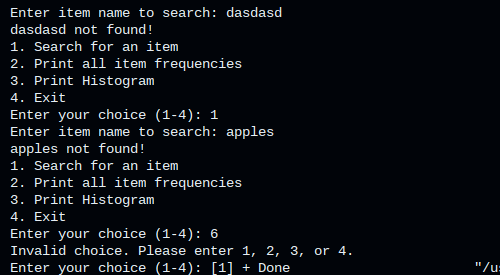
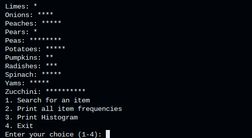

# Corner Grocer Item Tracking Program

# *Overview*
The Corner Grocer was in need of a program that 'analyzes the text records they generate throughout the day.' 

"These records list items purchased in chronological order from the time the store opens to the time it closes."

The program is a console based tracking app that reads this data from an input file and counts how many times each one appears, using a map. Then, it gives the user a menu to search for said item, print all the frequencies of the items, or display a complete histogram of the counts.

# *Features*
*   A built in histogram creator
*   Check item frequencies

# *How to Run*
Open the terminal in the project folder and compile the program with:

```bash
g++ -std=c++17 main.cpp -o corner_grocer
```

Then run it with:

```bash
./corner_grocer
```

Make sure the input file is in the same folder as the program so it can load the item data correctly.

# *Screenshots*



# *Design Notes*
The CornerGrocerApp class talks to the Menu class and handles the data processing, sending it back to the Menu class for display.
This was done to follow the tenets of Object Oriented Programming (OOP).

# *Technical Challenges*
This program had little hand holding compared to previous modules, which was great for stretching my design muscles to think about how I'd write this in the most scalable way-- being proud of my work. I decided to use object-oriented-programming as my base tenet, and found that it helped me to get my program pieced out in a way that was easily fixable, (not to mention rewarding to finish little bits at a time.)

One struggle I had, however, was the relationship between corner_grocer's app and the menu class. I don't know if I would have implemented it that way in the future, but I decided to settle on it being encapsulated as to increase clarity and improve readability/maintainability. It is in the design choices like this that it is clear how important it is to consider every step in the planning/psuedocode stage to reduce friction when actually writing code that not only compiles but has robust, built-in error catching and a modular design philosophy. If I did not have my flowchart I might not have wholly understood the relationship between the two (how they share data, the public and private member functions) and been at a loss when sitting at the IDE.

Altogether, I valued the challenge in this assignment, even if it was self-inflicted, it stresses the importance of clear understaning of your design philosophies.